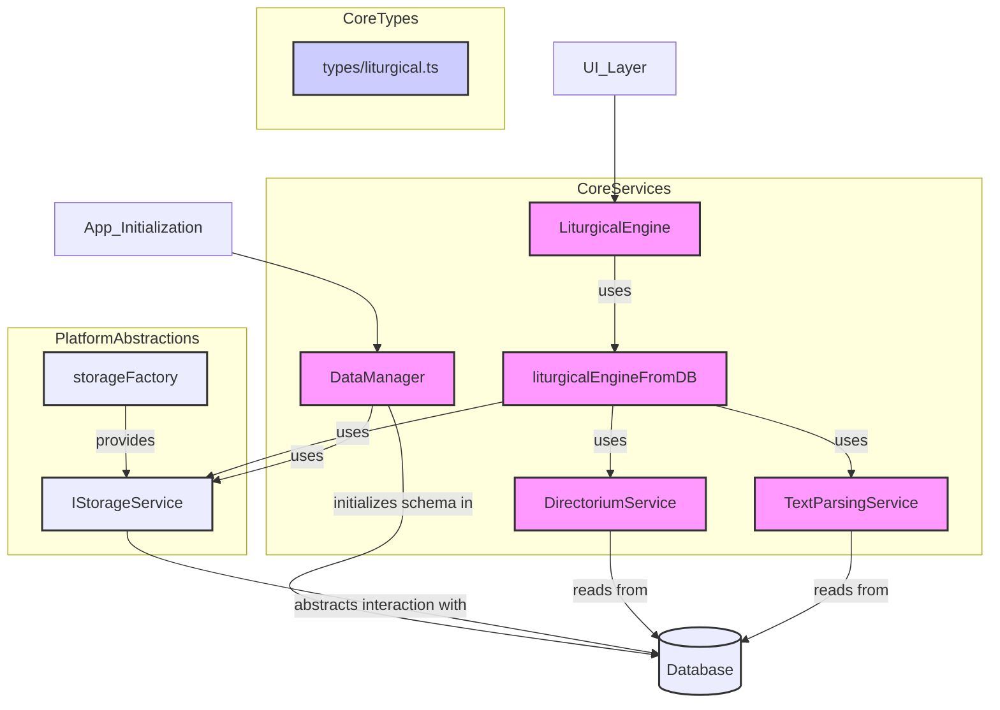

# Core Services - 2025-06-28 10:00:00

This document outlines the core services, centered around the `LiturgicalEngine`.

## 1. LiturgicalEngine (`src/core/services/LiturgicalEngineService.ts`)

- **Purpose:** Acts as the central orchestrator for all liturgical data.
- **Key Components:**
    - `LiturgicalEngine` (class):
        - `constructor(storageService: IStorageService)`: Takes a storage service instance.
        - `getLiturgicalDay(date: string): Promise<LiturgicalDay>`: Returns the full liturgical information for a given day.
        - `getMassText(date: string): Promise<BilingualText[]>`: Returns the Mass texts for a given day.

## 2. Supporting Services

- **`liturgicalEngineFromDB.ts`**: Implements the `ILiturgicalEngine` interface, fetching data from the database.
- **`TextParsingService.ts`**: Parses raw text from the database into structured `BilingualText` objects.
- **`DirectoriumService.ts`**: Manages the liturgical calendar, determining the correct feast and season for a given date.
- **`DataManager.ts`**: Handles database schema creation and data loading.
- **`storageFactory.ts`**: Provides the appropriate `IStorageService` implementation (web or native).

## Relationships and Flow (Mermaid Diagram)

