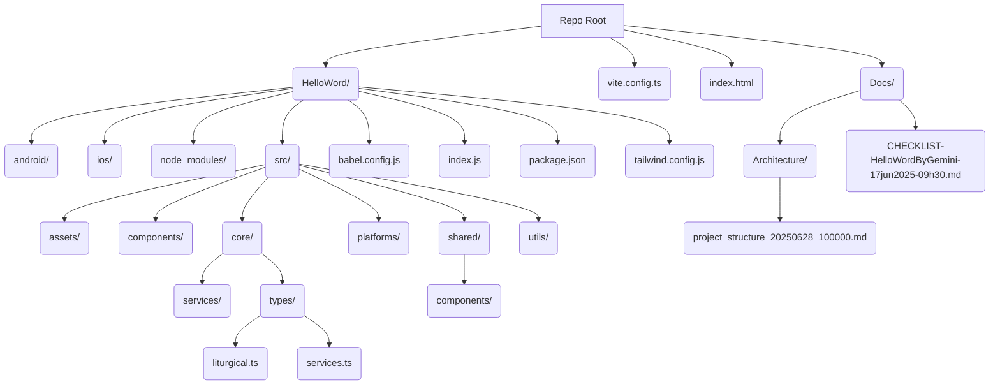

# Project Structure - 2025-06-28 10:00:00

This document outlines the initial project structure for HelloWord.

## Root Directory

- `HelloWord/`: The main React Native project directory.
  - `android/`: Android specific files.
  - `ios/`: iOS specific files.
  - `node_modules/`: Project dependencies.
  - `src/`: Application source code.
    - `assets/`: Static assets like images, fonts.
    - `components/`: Reusable UI components.
    - `core/`: Core application logic.
      - `services/`: Business logic services (e.g., `LiturgicalEngineService`, `DataManager`).
      - `types/`: TypeScript type definitions.
        - `liturgical.ts`: Defines types related to liturgical data (LiturgicalSeason, BilingualText, LiturgicalDay, VoiceNote).
        - `services.ts`: Defines interfaces for platform-specific services (IStorageService, IAudioRecorder, IDeviceInfo).
      - `utils/`: Utility functions.
    - `platforms/`: Platform-specific implementations (e.g., native SQLite, web IndexedDB).
    - `shared/`: Shared components and utilities.
      - `components/`: Reusable UI components shared across platforms.
  - `babel.config.js`: Babel configuration.
  - `index.js`: React Native entry point.
  - `package.json`: Project metadata and dependencies.
  - `tailwind.config.js`: Tailwind CSS configuration.
- `vite.config.ts`: Vite configuration for web support.
- `index.html`: HTML entry point for the web application.
- `Docs/`: Project documentation.
  - `Architecture/`: Architectural diagrams and descriptions.
  - `CHECKLIST-HelloWordByGemini-17jun2025-09h30.md`: Development checklist.

## Visual Representation (Mermaid Diagram)

