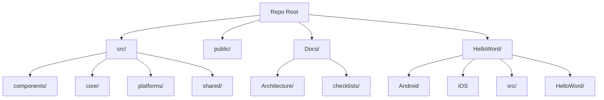

# Project Structure - 2025-07-02 03:20 UTC

This document describes the repository layout after the flattening of TypeScript code into the `src/` directory. The original React Native project remains in `HelloWord/`, and an older prototype exists at `HelloWord/HelloWord/`.

## Root Directory

- `src/` - Cross-platform TypeScript code used by the web application
- `public/` - Static web assets
- `HelloWord/` - React Native project (Android/iOS)
  - `android/`, `ios/`, `src/`, etc.
  - `HelloWord/` - Legacy subfolder containing early experiments
- `Docs/` - Project documentation
  - `Architecture/` - Architecture documents and diagrams
  - `checklists/` - Session checklists
- `package.json` - Vite-based web project configuration
- `vite.config.ts` - Build configuration

## Visual Representation (Mermaid)

