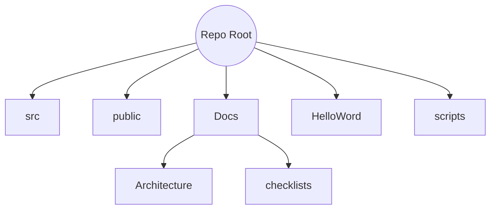

# Project Structure - 2025-07-02 03:48 UTC (Start)

This document captures the repository layout at the start of the session.

## Root Directory

- `src/` - Cross-platform TypeScript code
- `public/` - Static web assets
- `HelloWord/` - React Native project
- `Docs/` - Project documentation
- `scripts/` - Development helpers
- Config files and package manifests

## Visual Representation (Mermaid)

