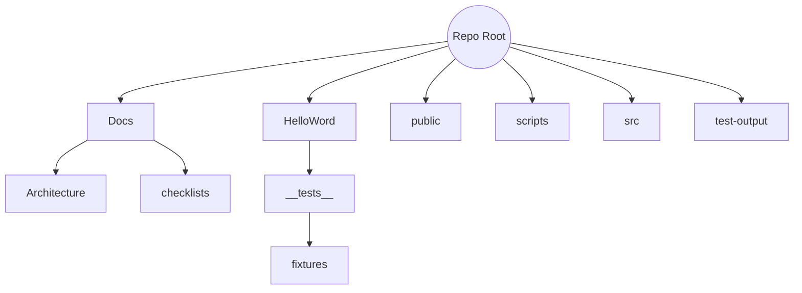

# Project Structure - 2025-07-02 18:55 UTC (Start)

Repository layout before addressing review feedback on integration test.

## Root Directory

- `src/` - Cross-platform TypeScript code
- `public/` - Static web assets
- `HelloWord/` - React Native project with tests and fixtures
- `Docs/` - Project documentation
- `scripts/` - Utility scripts
- `test-output/` - Past test results
- Config files and package manifests

## Visual Representation (Mermaid)

