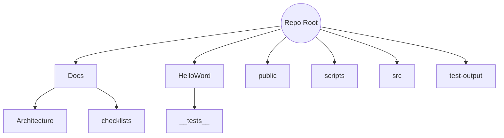

# Project Structure - 2025-07-02 18:56 UTC (End)

Repository layout after removing the large fixture and updating the test.

## Root Directory

- `src/` - Cross-platform TypeScript code
- `public/` - Static web assets
- `HelloWord/` - React Native project with integration tests
- `Docs/` - Project documentation
- `scripts/` - Utility scripts
- `test-output/` - Past test results
- Config files and package manifests

## Visual Representation (Mermaid)

