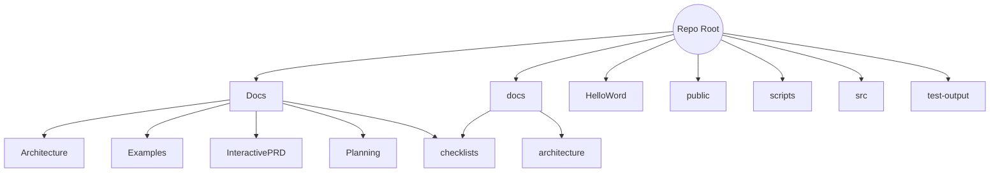

# Project Structure - 2025-07-03 04:47 UTC (End)

After merging the redundant `work` branch into `master` and deleting it, the repository layout remains unchanged. This snapshot records the state following the cleanup.

## Root Directory

- `src/` - Cross-platform TypeScript code
- `public/` - Static web assets
- `HelloWord/` - React Native project
- `Docs/` - Original project documentation
- `docs/` - Documentation area for architecture and checklists
- `scripts/` - Utility scripts
- `test-output/` - Past test results
- Config files and package manifests

## Visual Representation (Mermaid)

