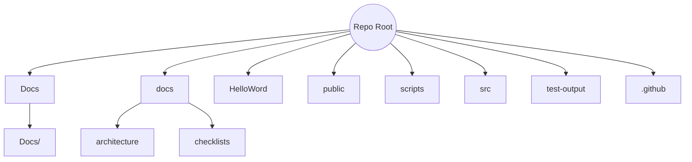

# Project Structure - 2025-07-03 06:31 UTC (Start)

This document captures the repository layout before changes in this session.

## Root Directory

- `src/` - Cross-platform TypeScript code
- `public/` - Static web assets
- `HelloWord/` - React Native project
- `Docs/` - Original project documentation
- `docs/` - Documentation (architecture and checklists)
- `scripts/` - Utility scripts
- `test-output/` - Test results and reports
- `tailwind.config.js`, `vite.config.ts`, `tsconfig.json`, etc. - Configuration files

## Visual Representation (Mermaid)

