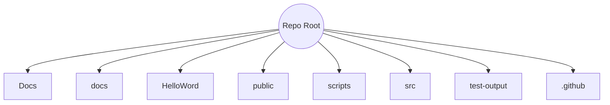

# Project Structure - 2025-07-03 06:34 UTC (End)

This snapshot records the repository layout after addressing build issues for production.

## Root Directory

- `src/` - Shared TypeScript source
- `public/` - Web assets
- `HelloWord/` - React Native project
- `Docs/` - Original docs
- `docs/` - Architecture and checklists
- `scripts/` - Utility scripts
- `test-output/` - Reports
- `tailwind.config.js`, `vite.config.ts`, etc.

## Visual Representation (Mermaid)

