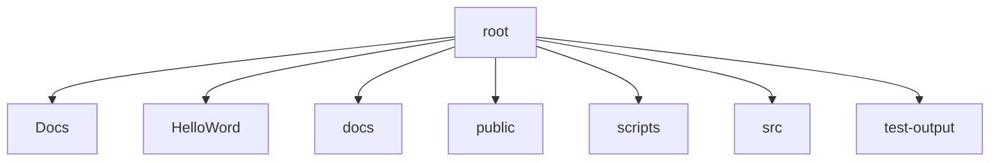

# Project Structure - 2025-07-06 04:59 UTC (Start)

This snapshot records the repository layout before implementing placeholder removal.

## Root Directory
- `BUILD_SYSTEM_LEARNINGS.md`
- `CLAUDE.md`
- `Docs`
- `HelloWord`
- `README.md`
- `RESUME_NOTES_27JUN2025.md`
- `ROADMAP.md`
- `docs`
- `package-lock.json`
- `package.json`
- `public`
- `scripts`
- `src`
- `tailwind.config.js`
- `test-output`
- `tsconfig.json`
- `vite.config.ts`
- `yarn.lock`

## Visual Representation (Mermaid)

